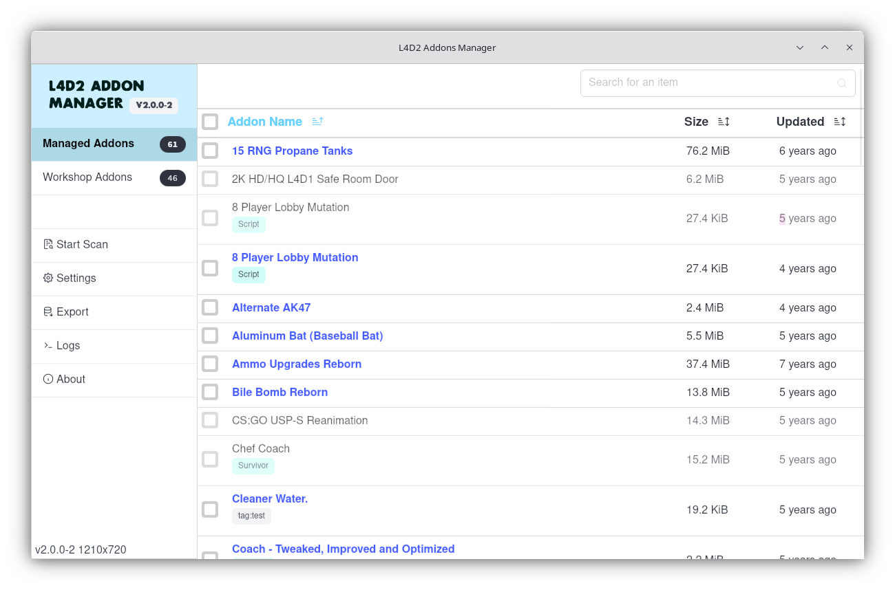

# L4D2 Addon Manager

A cross-platform app that lets you manage your l4d2 addons with ease, allowing you to quickly add, delete, disable, and search your long list of addons.
In addition, it lets you quickly offload workshop addons to be manually installed, allowing them to be loaded instantly on game startup.

> [!WARNING]  
> Currently in development. Works great on Linux, but weird scanning issues on Windows that are being worked on.
> Not all features have been completely tested, such as workshop migration. Use at your own risk.

### Current Features:

* Speedy addon list
* Scanning system that extracts data from addon files
  * Addon types (campaign, scripts, skins, weapons, sounds, etc)
  * Coop campaign chapter ids
* Searching & sorting
* User tagging of addons

### Potential Future Work

* Downloading new addons from workshop
* Updating manual addons from workshop
* Profiles (sets of addons) that can be swapped out and shared with others
* Testing on Windows
* GameMaps support

### Preview

## Building

1. Set DATABASE_URL (either via `src-tauri/.env`) or other means to where sqlite:// should be for testing
2. Install dependencies `pnpm i`
3. Build `cargo tauri build`
4. 

## License

MIT

